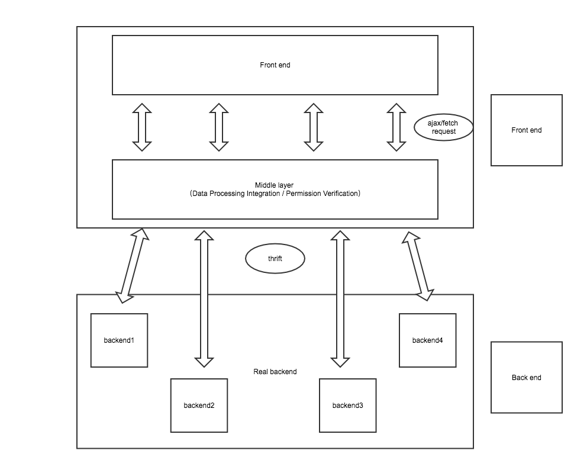

# Thrift tutorial
[中文 README](http://example.net/)  

This demo is used to help FE who is interested in thrift to get started with it.  
You can think of it as a simple tutorial.
# Basic architecture

# Main file structure
```
-|
 |- client                 // Front end
 |                          
 |- middle                 // Middle layer
 |  
 |- server                 // Real backend
 |
 |- thrift -|              // Folder to store thrift
            |
            |- gen-nodejs  // Folder to store .js
            |
            |- .thrift     // Folder to store .thrift

 // Note:
  This article using node as a server development language,
  part of the code from the official website,
  and then may be simplified so that we better understand.

```

Front end frames or library will be used:
- client : vue ( Just want to have a try... )
- middle : koa ( Because it's a very lightweight Library )
- server : thrift ( Normally, Java or some other back-end language should be used, but for convenience, use ... )

# How to run
- Firstly you should run the server by `npm run server`;
- Secondly you should run the node middle server by `npm run middle`;
- Lastly you can `cd client` and then `npm run dev`
- When you trigger event in client, you'll see the log in server terminal.
